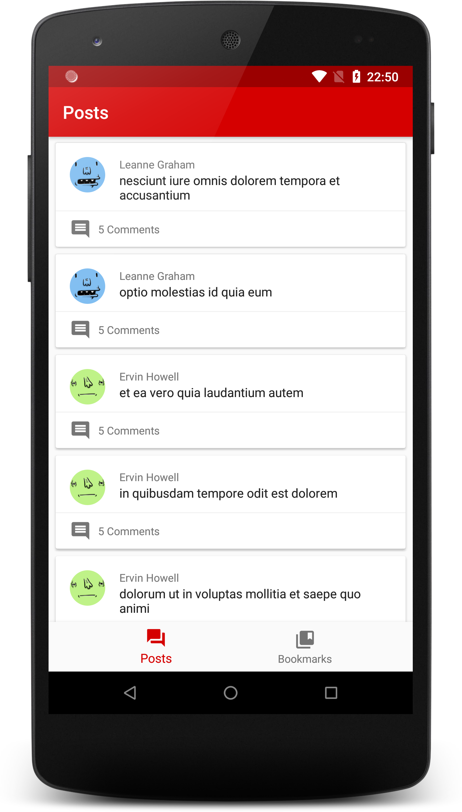
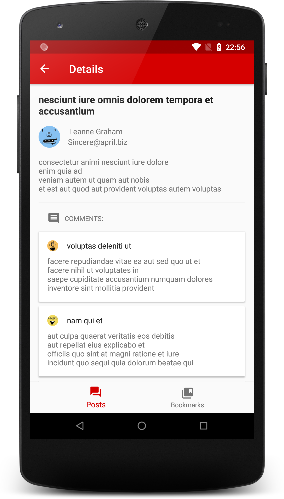
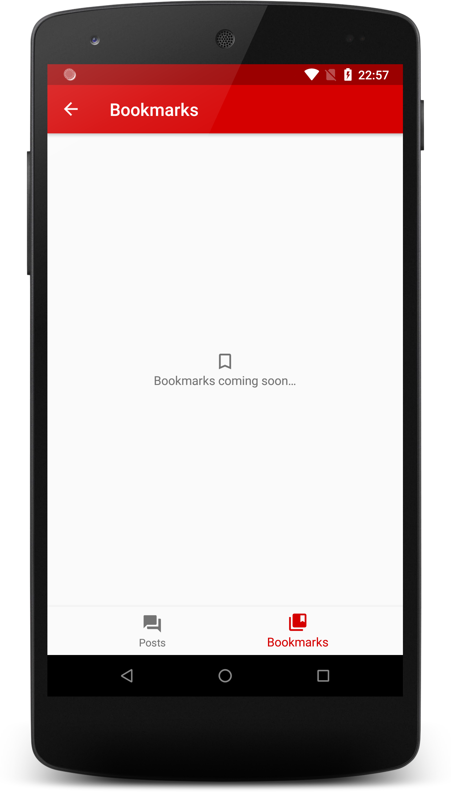

# Post-Apocalypse 

*In a world dominated by posts... one App will rule them all!*

Post-Apocalypse (excuse the pun) is a sample app for learning new things. This simple app uses three api requests to fetch a list of arbitrary posts, users and comments.

 

## Technical
This app has been initially structured using an MVP architecture as this is what I have the most experience using and testing.
I also dabbled a bit with MVI. However, due to time constraints, I will have to complete this in the future.

100% written in Kotlin. Of course.

Only presenters are completely covered by unit tests.

## Libraries
- Navigation Architecture components and AndroidX
- **Dagger Android**
- **Rx Android/Kotlin** - as I intent to use this for MVI
- Square: **Retrofit2**, **OkHttp3**, **Moshi**
- Jake Wharton: **Timber**, **RxBindings**
- **Glide** for image loading
- **Groupie** for easier RecyclerViews
- **Mockito** for unit tests

## Future improvements
- MVI
- Filter/search for post list
- Animations between screens
- UI Tests
- Room database for bookmarked posts

--------
#### Thank you for your time
